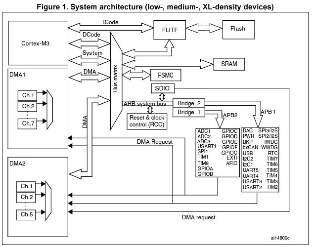
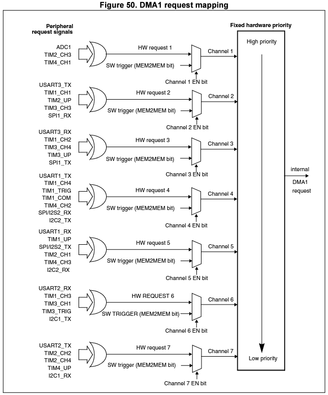
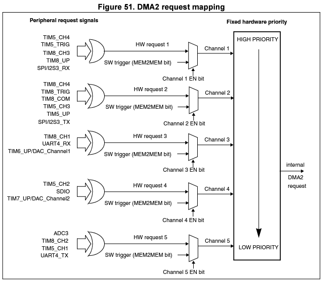

# STM32F103

This repository contains my libraries to use STM32F103C8T6 peripherals. It is written in C++ and uses Eclipse + OpenOCD + STLink-V2 to debug the bluepill board. It depends on *stdPeriph* libraries.
 
###### Bluepill specifications
* STM32F103C8T6 microcontroller (ARM Cortex-M3)
* 72MHz
* Flash: 64/128 KB
* SRAM: 20 KB
* 3 x General purpose + 1 x Advanced control timers
* 2 x SPI 
* 2 x I2C
* 3 x USART
* 1 x USB
* 1 x CAN
* 37 x GPIO
* 2 x ADC / 10 channels (12 bits)
* LQFP48 / UFQFPN48 package
* Little endian LSB first


###### Memory and bus architecture 

Clock domains for each peripheral:



* AHB and APB2  operates at full speeed (72MHz)
* APB1 is limited to **36MHz**


DMA channels for each peripheral:




### OpenOCD Configurations
Config options: 

    -f /usr/share/openocd/scripts/board/bluepill.cfg
	-f interface/stlink-v2.cfg 


### Putty command (Debugging via UART)
- Baud rate = 9600 (user defined)
- Data bit = 8
- Stop bits = 1
- Parity = None
- Flow control = None

```console
sudo putty /dev/ttyUSB0 -serial -sercfg 9600,8,n,1,N
```

### References and useful links
- [STM32F103xx datasheet](https://www.st.com/resource/en/datasheet/stm32f103c8.pdf)

- [STM32F103xx reference manual (RM0008)](https://www.st.com/resource/en/reference_manual/cd00171190-stm32f101xx-stm32f102xx-stm32f103xx-stm32f105xx-and-stm32f107xx-advanced-armbased-32bit-mcus-stmicroelectronics.pdf)

- [Description of STM32F2xx Standard Peripheral LIbrary](https://www.st.com/resource/en/user_manual/dm00023896-description-of-stm32f2xx-standard-peripheral-library-stmicroelectronics.pdf)

- [Eddie Amaya's youtube channel](https://www.youtube.com/watch?v=EX7g3_NUDgk&list=PLmY3zqJJdVeNIZ8z_yw7Db9ej3FVG0iLy) (great explanation for beginners!)